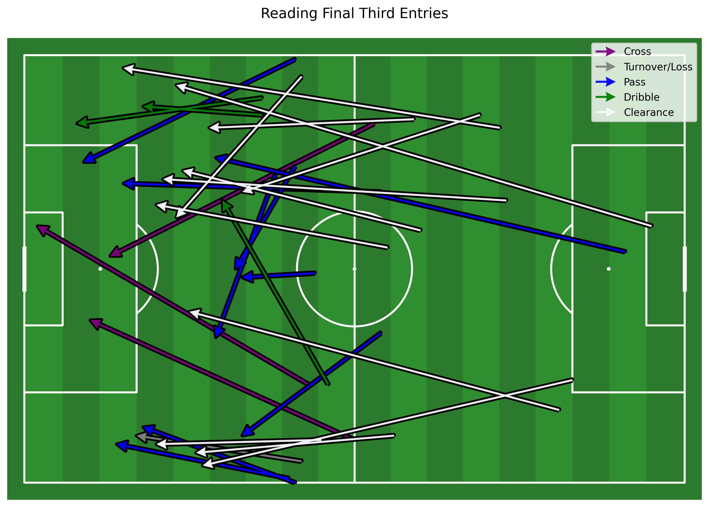
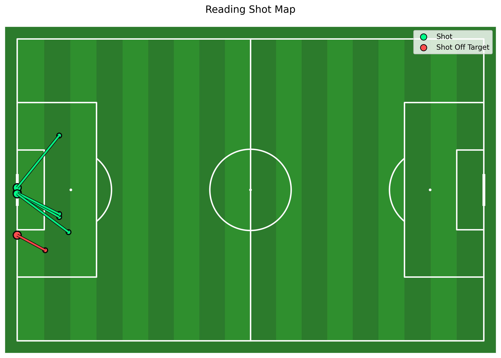

# kanso-analytics-project
# ⚽ Kanso Analytics Competition – Match Analysis Dashboard

This project was developed as part of the **Kanso Analytics Performance Analysis Competition**, where the objective was to extract match event data from video footage and transform it into a clear, interactive, and insightful dashboard.

---

## 📊 Project Overview

Using manually tagged event data from a full match, this project focuses on analyzing **Reading's performance**, with an emphasis on:

- Ball progression
- Final third entries
- Box entries
- Shot creation
- Ball recoveries and transitions

The data was processed using Python and visualized using both **mplsoccer** and **Power BI** to create a clean, user-friendly analytical dashboard.

---

## 🛠️ Tools & Technologies

- Python (pandas, numpy, matplotlib)
- mplsoccer (pitch visualizations)
- Power BI (interactive dashboard)
- Git & GitHub (version control)

---

## ⚙️ How to Run the Project

1. Clone the repository:
```bash
git clone https://github.com/fbriebdk/kanso-analytics-project.git
cd kanso-analytics-project
```

2. Install Dependencies:
```bash
pip install pandas numpy matplotlib mplsoccer
```

3. Run the analysis script:
```bash
python analysis.py
```

4. Outputs (CSV + visuals) will be generated in the outputs/ folder.

---

## 📁 Project Structure

kanso_analytics_project/
│
├── data/
│   ├── events_v1_h1.csv
│   ├── events_v2_h1.csv
│   └── final_events_half_1.csv
│
├── outputs/               # Generated visuals & datasets (ignored in Git)
│
├── analysis.py           # Main analysis pipeline
├── README.md
└── .gitignore

---

## 📈 Key Insights

- Reading City FC produced 58 progressive actions, indicating strong ability to move the ball forward.
- However, only 28 final third entries and 12 box entries were generated.
- This resulted in just 5 shots.

---

### 👉 Insight:

Reading City FC are effective at progressing into advanced areas, but struggle to convert possession into high-quality scoring opportunities. This suggests inefficiency in final third decision-making and chance creation.

---

## 🎯 Dashboard Focus

The Power BI dashboard is designed to:

- Provide a clear and structured performance overview
- Allow users to switch between key KPIs (interactive UX)
- Visualize tactical patterns using pitch maps
- Highlight strengths and weaknesses through data storytelling

---

## 📊 Example Visuals

### Final Third Entries


### Shot Map


### Progressive Actions


---

## 🚀 Future Improvements

- Include second half analysis
- Add player-level metrics
- Automate event tagging workflow
- Expand defensive and pressing analysis

---

## 📬 Contact

- Created by Liam,
- For collaboration or analytics opportunities, feel free to connect.
- LinkedIN: (https://www.linkedin.com/in/liam-bugeja-9957a0208/)
