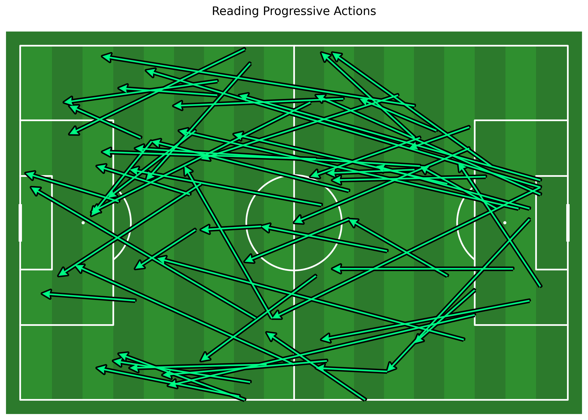

# ⚽ Football Analytics Project
> Turning raw match data into actionable insights.

---

## 📌 Overview
This project focuses on building a complete football analytics pipeline, transforming raw event data into meaningful insights. It covers data processing, event tagging, performance analysis, and visualization.

---

## 🚀 Features
- ✅ Event data cleaning and preprocessing  
- ✅ Custom event tagging logic  
- ✅ Player and team performance metrics  
- ✅ Data visualization dashboards  
- ✅ Modular and scalable project structure  

---

## 🛠️ Tech Stack
- **Python** (Pandas, NumPy, and more)
- **Power BI** 
- **Git & GitHub**

---

## 📂 Project Structure
football-analytics-project/
│
├── data/ # Raw and processed datasets
├── analysis.py # main python script
├── assets/ # Images used in README
├── outputs/
└── README.md

---

## 📊 Key Analysis Areas
- Player performance evaluation  
- Passing and progression metrics  
- Defensive and offensive event analysis  
- Custom KPIs based on match events  

---

## 📸 Visual Examples

### 📊  Reading Events Action Starts

### 🗺️ Reading Progressive Actions

> 📌 To display images correctly:
> - Place them inside an `assets/` folder
> - Use relative paths like: `assets/image.png`

---

## ⚙️ Setup & Installation

### 1. Clone the repository

git clone: https://github.com/fbriebdk/kanso-analytics-project.git

### 2. Navigate into the project

cd football-analytics-project

### 3. Create virtual environment (optional but recommended)

python -m venv .venv

Activate environment:

- Windows:

.venv\Scripts\activate

- Mac/Linux:

source .venv/bin/activate

### 4. Install dependencies

pip install -r requirements.txt

---

## ▶️ Usage
Run scripts or notebooks depending on your workflow:

- Use notebooks for exploration and analysis
- Use `src/` scripts for reusable processing logic
- Open dashboards in Power BI for visualization

---

## 🧠 Future Improvements
- Implement advanced metrics (xG, xA, etc.)
- Automate full data pipeline
- Deploy dashboards online
- Integrate live or API-based data sources

---

## 📬 Contact
Liam Bugeja
LinkedIN: https://www.linkedin.com/in/liam-bugeja-9957a0208/
